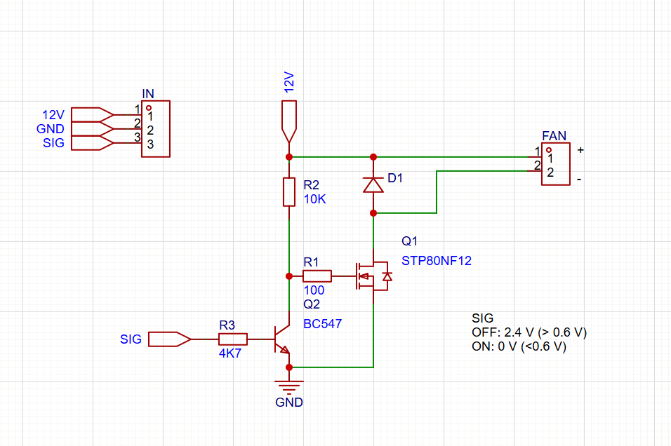

# TM Racing 300 EN Fi (MY2021) Fan Driver

## Overview
This project describes an electronics scheme for a custom **low-side switch** to run an arbitrary 12 V fan on a TM Racing 300 EN Fi MY2021 enduro motorcycle, using the bike's original fan connector.

Project file:
- `TM_fan_driver.eprj` (open with **EasyEDA Pro**)

The bike fan connector provides:
- `+12V`
- `GND`
- `Switching signal`

## Circuit Schematic

Signal behavior:
- `2.4 V` = **fan OFF**
- `0 V` = **fan ON**

## Purpose
The circuit lets you:
- Keep compatibility with the stock bike control logic
- Drive a non-stock (arbitrary) 12 V fan
- Use a robust low-side switching stage suitable for automotive/electrical noise conditions

## Functional Principle
A low-side switch controls the fan by switching the fan negative terminal to ground:
1. Fan positive is connected to bike `+12V`.
2. Fan negative is connected to the output of the low-side switch.
3. The low-side switch references bike `GND`.
4. The bike control signal (`2.4 V` OFF, `0 V` ON) is conditioned/inverted as needed to drive the low-side transistor/MOSFET correctly.

## Wiring Summary
- Bike `+12V` -> Fan `+`
- Bike `GND` -> Driver `GND` (and common ground)
- Bike `Switching signal` -> Driver `Signal input`
- Driver `Switched output` -> Fan `-`

## Design Notes
- Ensure all grounds are common.
- Use components rated for automotive transients and fan startup current.
- Add flyback/transient protection for inductive load behavior and wiring harness noise.
- Validate thermal performance of the switching device at maximum fan current.

## Validation Checklist
- Confirm connector pinout on the motorcycle harness.
- Measure control signal: around `2.4 V` when OFF, `0 V` when ON.
- Verify fan turns on only when signal is ON (`0 V`).
- Check voltage drop and switch temperature under continuous operation.

## Disclaimer
Use at your own risk. Verify wiring and electrical ratings before connecting to the motorcycle harness.